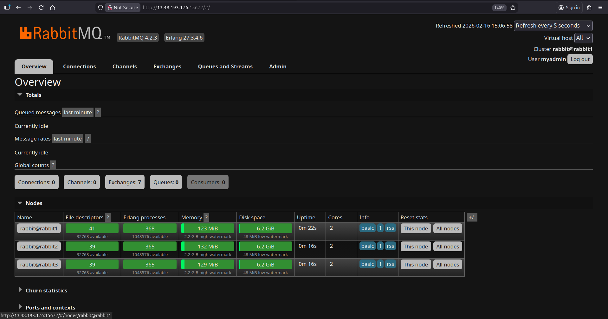
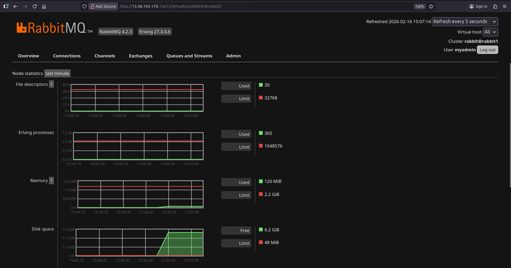

# 🐰 RabbitMQ Cluster Deployment with Ansible (3 Nodes)

Production-ready RabbitMQ cluster deployment using Ansible Roles.

This project deploys a 3-node RabbitMQ cluster with:

- Clustering enabled  
- Management UI enabled  
- Admin user configured  
- Guest user removed  
- Clean Ansible role structure  

---

# Architecture

<p align="center">
  
</p>


```
                    +------------------------+
                    |   Ansible Control VM   |
                    |------------------------|
                    |  Runs Playbooks        |
                    |  SSH to all nodes      |
                    +-----------+------------+
                                |
        -------------------------------------------------------
        |                     |                     |
+---------------+   +---------------+   +---------------+
|   rabbit1     |   |   rabbit2     |   |   rabbit3     |
|---------------|   |---------------|   |---------------|
| Master Node   |   | Cluster Node  |   | Cluster Node  |
| 5672  AMQP    |   | 5672  AMQP    |   | 5672  AMQP    |
| 15672 UI      |   | 15672 UI      |   | 15672 UI      |
| 25672 Cluster |   | 25672 Cluster |   | 25672 Cluster |
+---------------+   +---------------+   +---------------+
```

---

# Project Structure

```
rabbitmq-project/
├── inventory.ini
├── site.yml
└── roles/
    └── rabbitmq/
        ├── defaults/main.yml
        ├── handlers/main.yml
        ├── tasks/
        │   ├── main.yml
        │   ├── install.yml
        │   ├── config.yml
        │   ├── cluster.yml
        │   ├── users.yml
        │   └── verify.yml
        ├── templates/rabbitmq.conf.j2
        └── vars/
```

---

# Inventory File

```ini
[rabbitmq]
rabbit1 ansible_host=10.0.1.10
rabbit2 ansible_host=10.0.1.11
rabbit3 ansible_host=10.0.1.12
```

---

# Deployment Guide

## Run Deployment

```bash
cd rabbitmq-project
ansible-playbook -i inventory.ini site.yml
```

If using private key:

```bash
ansible-playbook -i inventory.ini site.yml --private-key ~/.ssh/mykey.pem
```

---

# Required Firewall / Security Group Ports

| Port        | Purpose                       |
|------------|--------------------------------|
| 4369       | Erlang Port Mapper             |
| 25672      | Inter-node clustering          |
| 5672       | AMQP                           |
| 15672      | Management UI                  |
| 35672-35682| Erlang distribution range      |

---

# Cluster Verification

```bash
sudo rabbitmqctl cluster_status
```

Expected:

```
{disc,[rabbit@rabbit1,rabbit@rabbit2,rabbit@rabbit3]}
```

---

# Deployment Screenshots

## RabbitMQ Management UI (Cluster Running)





This screenshot shows:
- RabbitMQ 4.2.3
- Erlang 27.x
- Cluster name: rabbit@rabbit1
- Node statistics active
- Management UI accessible via port 15672

---

## AWS EC2 Instances (All Running)


This screenshot confirms:
- 3 RabbitMQ nodes (rabbit1, rabbit2, rabbit3)
- 1 Ansible control server
- All instances running
- Status checks passed (3/3)
