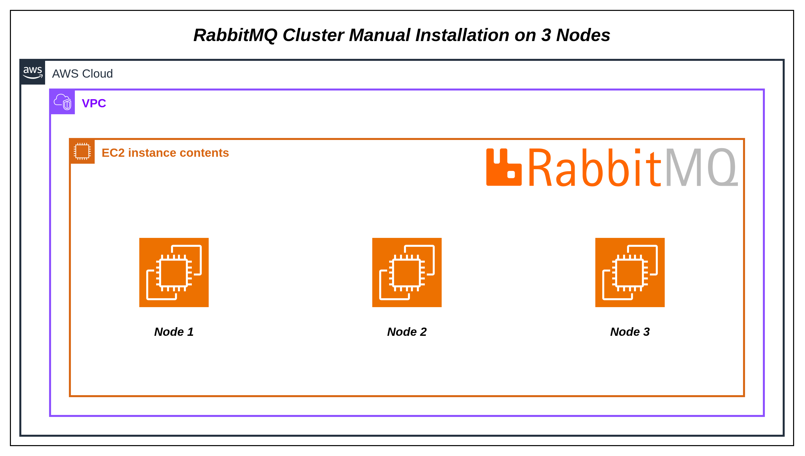
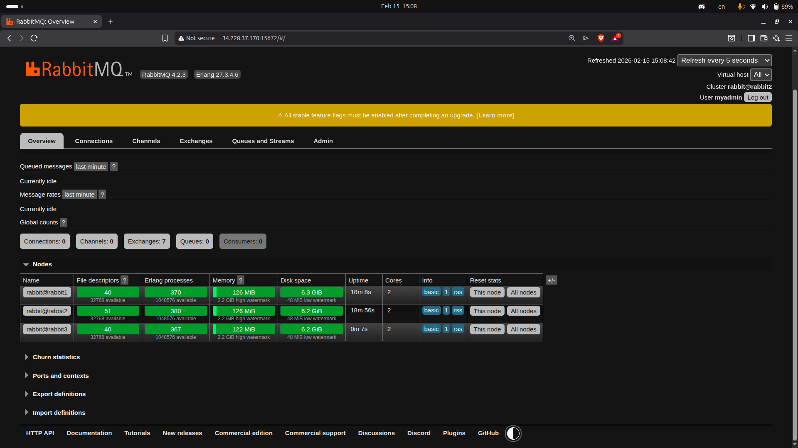
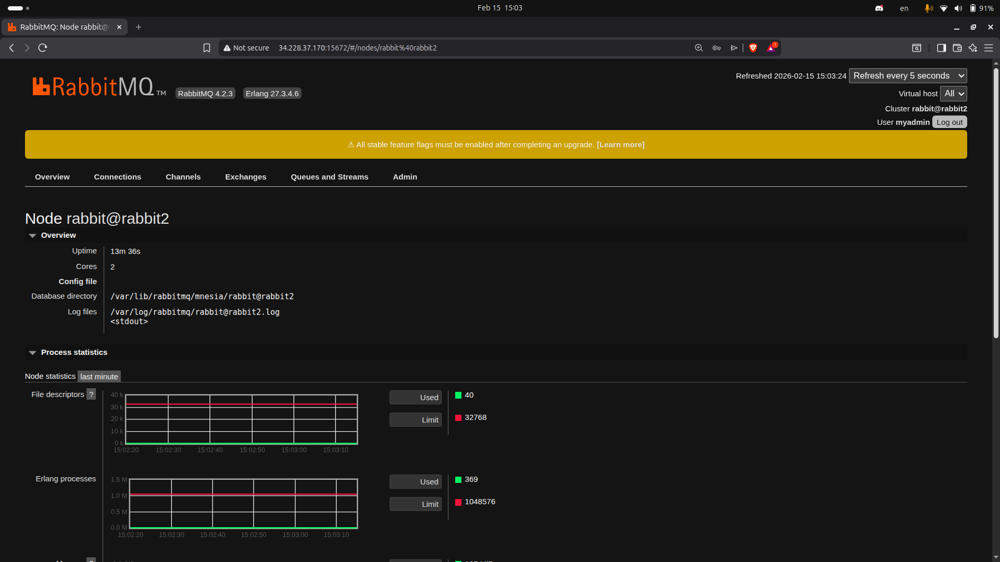
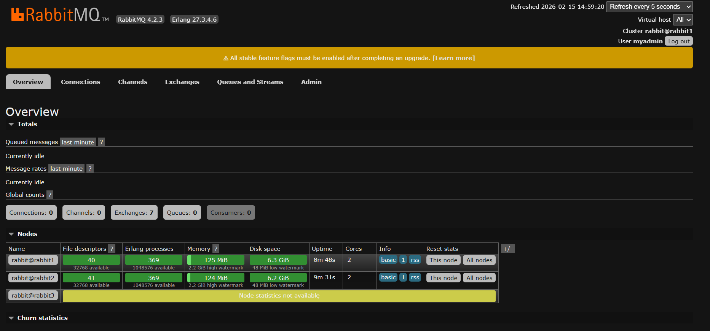
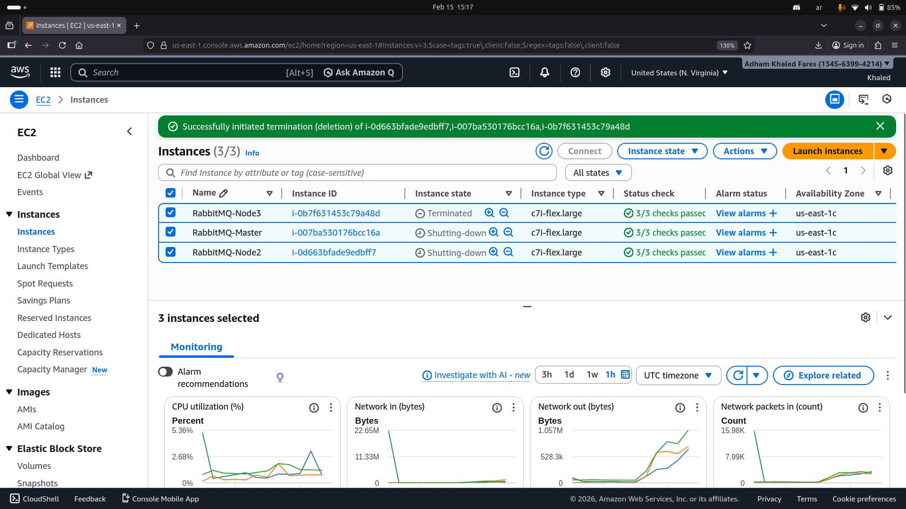

# RabbitMQ Cluster on Amazon Linux EC2

This guide explains how to install, configure, and verify a **RabbitMQ cluster** on **Amazon Linux EC2 instances**, including Management UI setup and troubleshooting common issues.

---

## Table of Contents

- [Overview](#overview)
- [Prerequisites](#prerequisites)
- [Installation](#installation)
  - [Update System](#update-system)
  - [Install Erlang](#install-erlang)
  - [Install RabbitMQ](#install-rabbitmq)
- [Cluster Configuration](#cluster-configuration)
  - [Set Hostnames](#set-hostnames)
  - [Synchronize Erlang Cookie](#synchronize-erlang-cookie)
  - [Join Nodes to Cluster](#join-nodes-to-cluster)
- [Management UI Setup](#management-ui-setup)
- [Security Considerations](#security-considerations)
- [Verification](#verification)
- [Troubleshooting](#troubleshooting)

## Overview

**RabbitMQ** is an open-source **message broker** that enables communication between distributed applications using queues.

It follows the Producer → Exchange → Queue → Consumer pattern.


---

## Cluster Architecture (Manual Installation)

Below is the architecture for manually installing a RabbitMQ Cluster on 3 Amazon Linux EC2 nodes:



---

## Prerequisites

- At least **2 EC2 instances** using **Amazon Linux 2 or 2023**
- **Security Group** rules allowing:
  - `4369` (Erlang Port Mapper)
  - `25672` (cluster communication)
  - `5672` (AMQP clients)
  - `15672` (Management UI)
- SSH access to all nodes

---

## Installation

### Update System

```bash
sudo yum update -y
```

### Install Erlang

Add repo and install Erlang:

```bash
sudo amazon-linux-extras enable epel
sudo yum install -y epel-release
sudo yum install -y erlang
```

If not found, use RabbitMQ RPM repo:

```bash
sudo rpm --import https://packages.rabbitmq.com/rabbitmq-release-signing-key.asc

sudo tee /etc/yum.repos.d/rabbitmq.repo <<EOF
[rabbitmq-server]
name=RabbitMQ Repository
baseurl=https://dl.cloudsmith.io/public/rabbitmq/rabbitmq-server/rpm/el/7/$basearch
gpgcheck=1
gpgkey=https://dl.cloudsmith.io/public/rabbitmq/rabbitmq-server/gpg.key
enabled=1
EOF

sudo yum install -y erlang
```

### Install RabbitMQ

```bash
sudo yum install -y rabbitmq-server
sudo systemctl enable --now rabbitmq-server
sudo systemctl status rabbitmq-server
```

---

## Cluster Configuration

### Set Hostnames

```bash
sudo hostnamectl set-hostname rabbit1   # on master
sudo hostnamectl set-hostname rabbit2   # on node2
```

- Ensure `/etc/hosts` has all node IPs:

```
10.0.1.10 rabbit1
10.0.1.11 rabbit2
```

- Restart RabbitMQ after changing hostnames:

```bash
sudo systemctl restart rabbitmq-server
```

### Synchronize Erlang Cookie

All nodes must have the **same cookie**:

```bash
# On master
sudo cat /var/lib/rabbitmq/.erlang.cookie

# On other nodes
sudo systemctl stop rabbitmq-server
echo "PASTE_MASTER_COOKIE_HERE" | sudo tee /var/lib/rabbitmq/.erlang.cookie
sudo chown rabbitmq:rabbitmq /var/lib/rabbitmq/.erlang.cookie
sudo chmod 400 /var/lib/rabbitmq/.erlang.cookie
sudo systemctl start rabbitmq-server
```

### Join Nodes to Cluster

On secondary nodes:

```bash
sudo rabbitmqctl stop_app
sudo rabbitmqctl join_cluster rabbit@rabbit1
sudo rabbitmqctl start_app
```

- Use only `rabbit@<hostname>`, **not your SSH user** (`ec2-user`).

# Deployment Screenshots

## RabbitMQ Management UI (Cluster Running)

From the Management UI:

- **Cluster Name:** rabbit@rabbit1
- **RabbitMQ Version:** 4.2.3
- **Erlang Version:** 27.x
- **Nodes in Cluster:**
  - rabbit@rabbit1 (Master)
  - rabbit@rabbit2
  - rabbit@rabbit3



This screenshot shows:

- RabbitMQ 4.2.3
- Erlang 27.x
- Cluster name: rabbit@rabbit1
- Node statistics active
- Management UI accessible via port 15672

---

---

## Node Statistics (Per Node)

Each running node displays real-time metrics:



### ⚙ Erlang Processes

- Used: ~300–400
- Limit: 1,048,576
- System operating within safe threshold

### 💾 Memory Usage

- Used: ~120 MiB
- Limit: ~2.2 GiB
- No memory alarm triggered

### Disk Space

- Free: ~6+ GiB
- Disk alarm threshold not reached
- Cluster operating normally

---

---

# High Availability (HA) Configuration

In this RabbitMQ 3-node cluster, High Availability ensures that messages are not lost if one node fails.

## How HA Works

- Queues are mirrored (replicated) across multiple nodes.
- If the master queue node fails, a mirror is automatically promoted.
- Clients can reconnect through a Load Balancer.
- No message loss during single-node failure.



## ☁ AWS EC2 Instances (All Running)



This screenshot confirms:

- 3 RabbitMQ nodes (rabbit1, rabbit2, rabbit3)
- 1 Ansible control server
- All instances running
- Status checks passed (3/3)

---

---

## Management UI Setup

Enable UI:

```bash
sudo rabbitmq-plugins enable rabbitmq_management
```

- Access via browser: `http://<EC2-private-IP>:15672`

### Create Admin User (recommended)

```bash
sudo rabbitmqctl add_user myadmin MyStrongPassword123
sudo rabbitmqctl set_user_tags myadmin administrator
sudo rabbitmqctl set_permissions -p / myadmin ".*" ".*" ".*"
```

- Login: `Username: myadmin`, `Password: MyStrongPassword123`

> **Note:** Default `guest/guest` can only log in locally. For remote access, create a new admin user.

---

## Security Considerations

- Only open **15672** to trusted IPs (e.g., your VPN or private network).
- Use **private IPs** for inter-node communication.
- Consider disabling `guest` user after creating admin.

```bash
sudo rabbitmqctl delete_user guest
```

---

## Verification

1. **Check node status:**

```bash
sudo rabbitmqctl status
```

2. **Check cluster status:**

```bash
sudo rabbitmqctl cluster_status
```

- All nodes should appear under `{nodes,[{disc,[rabbit@rabbit1,rabbit@rabbit2]}]}`

3. **Check Erlang cookie consistency:**

```bash
sudo cat /var/lib/rabbitmq/.erlang.cookie
```

4. **Ping nodes to verify hostname resolution:**

```bash
ping rabbit1
ping rabbit2
```

5. **Optional:** Test message passing via Management UI.

---

## Troubleshooting

- **`Erlang distribution failed / noconnection`**
  - Check hostnames match node names
  - Verify Erlang cookies are identical
  - Verify ports `4369` and `25672` are open

- **`guest user cannot login remotely`**
  - Create a new admin user or disable loopback restriction:

```bash
sudo nano /etc/rabbitmq/rabbitmq.conf
# Add
loopback_users.guest = false
sudo systemctl restart rabbitmq-server
```

- **Cluster join fails**
  - Ensure node is stopped (`stop_app`) before joining
  - Use correct node name `rabbit@<hostname>`
  - Check firewall / security groups

---

## References

- [RabbitMQ Documentation](https://www.rabbitmq.com/documentation.html)
- [RabbitMQ Clustering Guide](https://www.rabbitmq.com/clustering.html)
- [Amazon Linux Docs](https://docs.aws.amazon.com/linux/)
